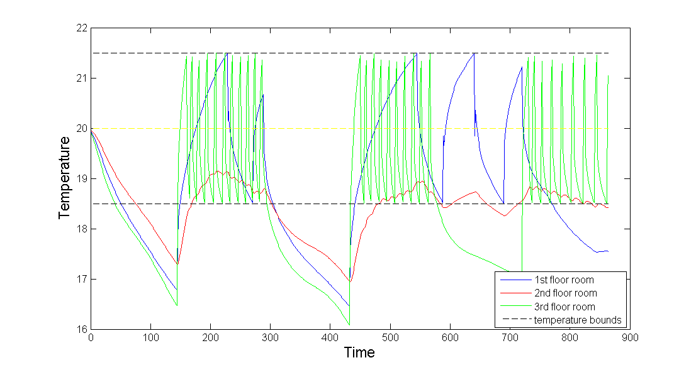

# Intelligent Hotel Reservations Assignment to Rooms in Pursuit of Energy Usage Miniization

This project is a generic development sponsored by the University of Genove in Italy. The main idea relies in assigning clients of a hotel to specific rooms in it ensuring heating energy usage minimization by the principle of heat concentration in specific areas of the hotel.

The algorithms are just a step before adaptiveness and can easily be extended to the online learning paradigm, in which the system estimates its own energy efficiency transmission and takes decisions of assignment based on its own found strengths and weaknesses, mainly in the thermical structure of the hotel.

## Motivation
Energy management is one of the most important aspects
treated in Engineering and sciences. Either a path planning problem or an energy harvesting field of wind turbines, the
necessity to ensure optimality is always present when competitivity is desired. Optimisation at the service of Engineering
is a broad field of development and deals with a very dynamic
set of applications that can be present even in the normal life

Hotels and other accommodation providers deal with the problem of assigning booking requests in an optimum way.
The majority of homologous systems attempt to forecast the energy consumption of the analysed buildings or to monitor
it and propose alternative solutions to decrease it. Others already go a step further in proposing systems that optimise
tenants’ comfort or energy consumption reduction by means of techniques like reinforcement learning, while at
the same time adapting them to the usage pattern of the user.
While approaching in the same manner the multi objective problem of assigning the rooms to the guests in the most profitable way, this work deals also with the construction of anagent with an extra intelligence layer capable of choosing
assignment sequences that ensure optimality in the sense of energy consumption. For detailed explanations look at our explanatory paper <a href='Report_Caravelli_Denicia_Sansebastiano/Report_Caravelli_Denicia_Sansebastiano1.pdf'>here</a>  

## Code
The code is divided in the modelling and the assignment recommendation parts of the computation chain. In both cases Matlab was used and in the case of the optimization algorithms, Gurobi was selected due to its nice support for linear optimization processes. 
- A linear differential model was used and its preparation can be found here: Modelling/Linear_differential_model including the dynamic equations used for heat transference modelling and the integration machinery.
- Non linear parameter identification can be found here Sys_ID/Nonlin_param_id/ including the computation of heat capacitances per room and linear transmission coefficients among rooms in a non linear least squares approach.
- Optimization formulation: Can be found here Optimisation/Formulation/ including several scripts generating the assignment decisions out of the optimization formalism planned in Gurobi syntax in Matlab.
- Report, paper and presentations can be found in Report_Caravelli_Denicia_Sansebastiano and in Presentation

## Results
The results show that this algorithm does save from around 2% to 5% of heating energy expenses just by assigning clients intelligently to rooms. If the demand is bigger, then the hotel gets filled more and from this formalism no bigger energy gain is ensured. It could be possible tochange the mathematical formalism to find the best heating points that ensure maximum transmission of energy among rooms and therefore as well minimizes heating time while keeping the energy consumption in a lower level.

Hotel | 30% | 50% | 65%
--- | --- | --- | ---
1 | 5.2% | 6.7% | 5.6%
2 | 2.9% | 9.5% | 5.2%
3 | 2.7% | 1.5% | 1.7%
